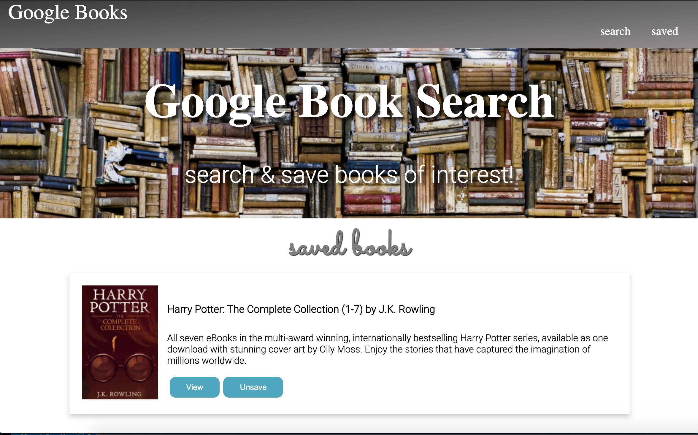

# GoogleBooks

## Deployed Link: https://rk-googlebooks.herokuapp.com/




---

## Description

  *The what, why, and how:*

`PROJECT DESCRIPTION:` For this assignment, we had to create a new React-based Google Books Search app. This assignment required us to create React components, pages, work with helper/util functions, and utilize React lifecycle methods to query and display books based on user searches. We had to also use Node, Express and MongoDB so that users can save books to review or purchase later.


  ---


## Table of Contents

  - [Deployed Site](#deployed-site)
  - [Description](#description)
  - [Usage](#usage)
  - [Technologies](#technologies)
  - [Directory Structure](#directory-structure)
  - [Questions](#questions)
 
 ---


## Usage
  *Instructions and examples for use:*

To run this application:
1. Visit the deployed link above

2. Search for any book to see the results displayed

3. Press 'view' to be taken to the Google link via api, or press 'save' to save the book as a favorite

4. Check out your 'saved' books tab!

5. Delete any book from your favorites by pressing the 'unsave' button

---


## Technologies
*Technologies used in this project:*
 - Javascript
 - Node.js
 - Reat.js
 - MongoDB

 ---
 

## Directory Structure
```
├── node_modules
│ 
├── client
│   └── >public
│   └── >src  
│       └── >components
│           └── >Container
│           └── >Header
│           └── >Nav
│           └── >Results
│           └── >SearchForm
│       └── >pages
│           └── NoMatch.js
│           └── Saved.js
│           └── Search.js
│           └── style.css

│       └── >utils
│           └── API.js
│       └── App.css 
│       └── App.js
│       └── index.js
│       └── serviceWorker.js
│       └──>pages
│           └── NoMatch.js
│           └── Saved.js
│           └── Search.js
│           └── Style.css
├── package.json
├──>controllers
│   └── booksControllers.js 
│  
├──>models
│   └── book.js
│   └── index.js  
│   
├──>routes
│    └── index.js
│    └──>API
│       └── books.js
│       └── index.js
│ 
├──>scripts
│    └── seedDB.js
│ 
├── package.json
│ 
├── >rmImgs
│ 
├── server.js
│ 
└── README.md
```

---


## Questions?

  *For any questions about this application, please contact me via the information below:*

  * **GitHub:** https://github.com/rachelkline
  
  * **Email:** rachel_kline@icloud.com

---
  <br>

  [Icons provided by https://fontawesome.com/]